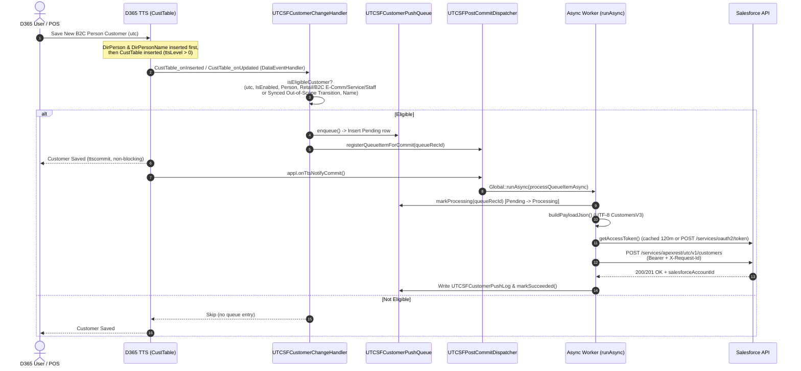
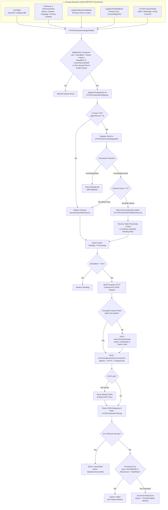

# UTC Dynamics 365 F&O to Salesforce Customer Push Workflow

## 1. New Customer Creation Flow (Sequence Diagram)

```mermaid
sequenceDiagram
    autonumber
    actor User as D365 User / POS
    participant D365 as D365 TTS (CustTable)
    participant Handler as UTCSFCustomerChangeHandler
    participant Queue as UTCSFCustomerPushQueue
    participant Disp as UTCSFPostCommitDispatcher
    participant Worker as Async Worker (runAsync)
    participant SF as Salesforce API

    User->>D365: Save New B2C Person Customer (utc)
    Note over D365: DirPerson & DirPersonName inserted first,<br/>then CustTable inserted (ttsLevel > 0)
    D365->>Handler: CustTable_onInserted / CustTable_onUpdated (DataEventHandler)
    Handler->>Handler: isEligibleCustomer?<br/>(utc, IsEnabled, Person, Retail/B2C E-Comm/Service/Staff<br/>or Synced Out-of-Scope Transition, Name)

    alt Eligible
        Handler->>Queue: enqueue() -> Insert Pending row
        Handler->>Disp: registerQueueItemForCommit(queueRecId)
        D365-->>User: Customer Saved (ttscommit, non-blocking)
        D365->>Disp: appl.onTtsNotifyCommit()
        Disp->>Worker: Global::runAsync(processQueueItemAsync)
        Worker->>Queue: markProcessing(queueRecId) [Pending -> Processing]
        Worker->>Worker: buildPayloadJson() (UTF-8 CustomersV3)
        Worker->>SF: getAccessToken() (cached 120m or POST /services/oauth2/token)
        Worker->>SF: POST /services/apexrest/utc/v1/customers<br/>(Bearer + X-Request-Id)
        SF-->>Worker: 200/201 OK + salesforceAccountId
        Worker->>Queue: Write UTCSFCustomerPushLog & markSucceeded()
    else Not Eligible
        Handler-->>D365: Skip (no queue entry)
        D365-->>User: Customer Saved
    end
```

---

## 2. Full End-to-End Integration Architecture (Flowchart)

```mermaid
flowchart TD
    subgraph T["1. Change Detection (Inside ERP/POS Transaction)"]
        A1["CustTable<br/>(Inserted / Updated diff)"]
        A2["DirPerson & DirPersonName<br/>(Name / Gender / Language / Primary Contact)"]
        A3["LogisticsElectronicAddress<br/>(Primary Phone / Email)"]
        A4["LogisticsPostalAddress<br/>(Primary City / CountryRegionId)"]
        A5["UTCSFCustomerState<br/>(SMS / WhatsApp / Email Consent)"]
    end

    A1 --> H["UTCSFCustomerChangeHandler"]
    A2 --> H
    A3 --> H
    A4 --> H
    A5 --> H

    H --> E{"Eligible B2C Customer?<br/>(utc + IsEnabled + Person + Name +<br/>Retail/B2C E-Comm/Service/Staff<br/>or Prior Synced Out-of-Scope Group)"}
    E -- "No" --> SKIP["Skip (No Queue Entry)"]
    E -- "Yes" --> ENQ["Append Pending Row to<br/>UTCSFCustomerPushQueue"]

    ENQ --> TTS{"In Active TTS?<br/>(appl.ttsLevel > 0)"}
    TTS -- "No" --> ASYNC["Global::runAsync<br/>(processQueueItemAsync)"]
    TTS -- "Yes" --> REG["Register RecId in<br/>UTCSFPostCommitDispatcher"]

    REG --> COMMIT{"Transaction Outcome"}
    COMMIT -- "onTtsNotifyAbort" --> CLR["Clear Pending Set<br/>(DB Rollback)"]
    COMMIT -- "onTtsNotifyCommit" --> FAN{"Queued Count <= 5?"}

    FAN -- "Yes (Real-Time)" --> ASYNC
    FAN -- "No (Bulk Import)" --> BATCH["Recurring SysOperation Batch<br/>(UTCSFCustomerPushBatchService)"]

    BATCH --> REC["Recover Stale Processing (>15m)<br/>& Coalesce Duplicate Pending Rows"]
    REC --> CLAIM
    ASYNC --> CLAIM["Atomic Claim:<br/>Pending -> Processing"]

    CLAIM --> EN{"IsEnabled == Yes?"}
    EN -- "No" --> RST["Reset to Pending"]
    EN -- "Yes" --> PAY["Build Compact UTF-8<br/>CustomersV3 JSON Payload"]

    PAY --> TOK{"Encrypted Cached Token<br/>Valid (>5m buffer)?"}
    TOK -- "Yes" --> POST
    TOK -- "No" --> OAUTH["POST /services/oauth2/token<br/>(client_credentials) & Cache 120m"]
    OAUTH --> POST["POST /services/apexrest/utc/v1/customers<br/>(Bearer + UTF-8 + X-Request-Id)"]

    POST --> R401{"HTTP 401?"}
    R401 -- "Yes (Once)" --> REAUTH["Force Refresh Token<br/>& Retry POST Once"]
    REAUTH --> PARSE
    R401 -- "No" --> PARSE["Parse JSON Response &<br/>Write UTCSFCustomerPushLog"]

    PARSE --> OK{"2xx & Record Success?"}
    OK -- "Yes" --> SUCC["Queue: Succeeded<br/>(Store SalesforceAccountId)"]
    OK -- "No" --> PERM{"Permanent 4xx<br/>(excl. 401/408/429) or<br/>RetryCount >= MaxRetry?"}
    PERM -- "Yes" --> FAIL["Queue: Failed<br/>(No Further Retries)"]
    PERM -- "No (Transient)" --> RETRY["Increment RetryCount<br/>Queue -> Pending (Batch Retries)"]
```
